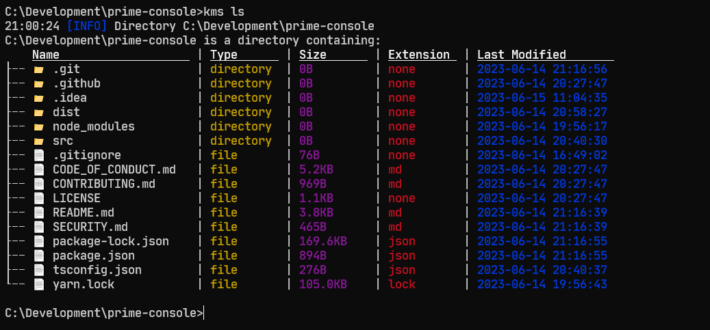

# KMS

Rust adaptation of windows and linux commands.

## Screenshots




### Installation

#### Installation
```cargo install kms```


## Commands

| Command | Arguments     | Description                |
| :-------- | :------- | :------------------------- |
| `ls` | `<file_name>` | Display files in directory |
| `mkdir` | `<dir_name>` | Create new directory |
| `touch` | `<file_name>` | Create new file |
| `rmdir` | `<dir_name>` | Remove directory |
| `del` | `<file_name>` | Remove file |
| `cat` | `<file_name>` | Read file |
| `tail` | `<file_name>` | Get 10 last lines of file |

## Authors

- [@malezjaa](https://www.github.com/malezjaa)

